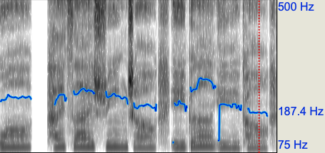
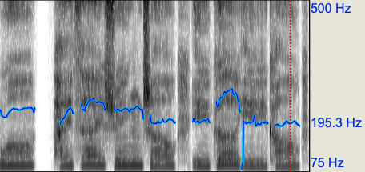
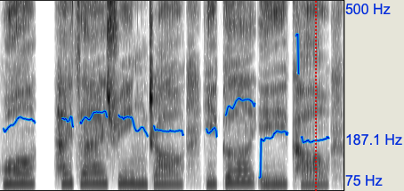

# Abstract

  The single-speaker singing voice synthesis (SVS) usually underperforms at pitch values that are out of the singer's vocal range or associated with limited training samples. Based on our previous work, this work proposes a melody-unsupervised multi-speaker pre-training method conducted on a multi-singer dataset to enhance the vocal range of the single-speaker, while not degrading the timbre similarity. This pre-training method can be deployed to a large-scale multi-singer dataset, which only contains audio-and-lyrics pairs without phonemic timing information and pitch annotation. Specifically, in the pre-training step, we design a phoneme predictor to produce the frame-level phoneme probability vectors as the phonemic timing information and a speaker encoder to model the timbre variations of different singers, and directly estimate the frame-level f0 values from the audio to provide the pitch information. These pre-trained model parameters are delivered into the fine-tuning step as prior knowledge to enhance the single speaker's vocal range. Moreover, this work also contributes to improving the sound quality and rhythm naturalness of the synthesized singing voices. It is the first to introduce a differentiable duration regulator to improve the rhythm naturalness of the synthesized voice, and a bi-directional flow model to improve the sound quality. Experimental results verify that the proposed SVS system outperforms the baseline on both sound quality and naturalness. 

    
     
    
 Fig.1: The structure of the proposed model. 

# Subjective Evaluation 
To demonstrate that our proposed model can significantly improve the naturalness and expressiveness of the synthesized singing voice, some samples are provided for comparison. **GT** means ground truth. **VISinger** represents the baseline model we are comparing, and **Proposed** means the proposed model with semantic extraction module、energy predictor and pitch predictor, which are described in detail in the paper. 

| Target Chinese Text | GT | Baseline | Proposed |
| :----:| :----:| :----:| :----:| :----:|
| 你说我不该不该不该在这时候 | <audio controls><source src="./wavs/gt/1.wav" type="audio/wav">Your browser does not support the audio element.</audio> | <audio controls><source src="./wavs/baseline/1.wav" type="audio/wav">Your browser does not support the audio element.</audio> | <audio controls><source src="./wavs/proposed/1.wav" type="audio/wav">Your browser does not support the audio element.</audio> |
| 昂首到达每一个地方这世界的太阳 | <audio controls><source src="./wavs/gt/2.wav" type="audio/wav">Your browser does not support the audio element.</audio> | <audio controls><source src="./wavs/baseline/2.wav" type="audio/wav">Your browser does not support the audio element.</audio> | <audio controls><source src="./wavs/proposed/2.wav" type="audio/wav">Your browser does not support the audio element.</audio> |
| 青春嫩绿得 | <audio controls><source src="./wavs/gt/3.wav" type="audio/wav">Your browser does not support the audio element.</audio> | <audio controls><source src="./wavs/baseline/3.wav" type="audio/wav">Your browser does not support the audio element.</audio> | <audio controls><source src="./wavs/proposed/3.wav" type="audio/wav">Your browser does not support the audio element.</audio> |
| 很鲜明 | <audio controls><source src="./wavs/gt/4.wav" type="audio/wav">Your browser does not support the audio element.</audio> | <audio controls><source src="./wavs/baseline/4.wav" type="audio/wav">Your browser does not support the audio element.</audio> | <audio controls><source src="./wavs/proposed/4.wav" type="audio/wav">Your browser does not support the audio element.</audio> |
| 想知道关于我的事情                     | <audio controls><source src="./wavs/gt/5.wav" type="audio/wav">Your browser does not support the audio element.</audio> | <audio controls><source src="./wavs/baseline/5.wav" type="audio/wav">Your browser does not support the audio element.</audio> | <audio controls><source src="./wavs/proposed/5.wav" type="audio/wav">Your browser does not support the audio element.</audio> |
我还在寻找一个依靠                     | <audio controls><source src="./wavs/gt/6.wav" type="audio/wav">Your browser does not support the audio element.</audio> | <audio controls><source src="./wavs/baseline/6.wav" type="audio/wav">Your browser does not support the audio element.</audio> | <audio controls><source src="./wavs/proposed/6.wav" type="audio/wav">Your browser does not support the audio element.</audio> |
不要再沉默徘徊                     | <audio controls><source src="./wavs/gt/7.wav" type="audio/wav">Your browser does not support the audio element.</audio> | <audio controls><source src="./wavs/baseline/7.wav" type="audio/wav">Your browser does not support the audio element.</audio> | <audio controls><source src="./wavs/proposed/7.wav" type="audio/wav">Your browser does not support the audio element.</audio> |
冲破这层层阻碍                     | <audio controls><source src="./wavs/gt/8.wav" type="audio/wav">Your browser does not support the audio element.</audio> | <audio controls><source src="./wavs/baseline/8.wav" type="audio/wav">Your browser does not support the audio element.</audio> | <audio controls><source src="./wavs/proposed/8.wav" type="audio/wav">Your browser does not support the audio element.</audio> |
我才明白外面世界如此精彩                     | <audio controls><source src="./wavs/gt/9.wav" type="audio/wav">Your browser does not support the audio element.</audio> | <audio controls><source src="./wavs/baseline/9.wav" type="audio/wav">Your browser does not support the audio element.</audio> | <audio controls><source src="./wavs/proposed/9.wav" type="audio/wav">Your browser does not support the audio element.</audio> |
时间飞这生命似钟摆                     | <audio controls><source src="./wavs/gt/10.wav" type="audio/wav">Your browser does not support the audio element.</audio> | <audio controls><source src="./wavs/baseline/10.wav" type="audio/wav">Your browser does not support the audio element.</audio> | <audio controls><source src="./wavs/proposed/10.wav" type="audio/wav">Your browser does not support the audio element.</audio> |

* * *

# Ablation Study 
We further conduct an ablation study to validate different contributions in our proposed method.  We remove energy predictor, semantic extraction module respectively and design a semantic extraction module with different structure named reversed semantic extraction module, abbreviated as reversed SEM, to replace the semantic extraction module. The audio samples are present below.

| Target Chinese Text |  GT | Proposed | without pretrain | without bi-flow |
| :----:| :----:| :----:| :----:|:----:|:----:|
| 你说我不该不该不该在这时候 | <audio controls><source src="./wavs/gt/1.wav" type="audio/wav">Your browser does not support the audio element.</audio> | <audio controls><source src="./wavs/proposed/1.wav" type="audio/wav">Your browser does not support the audio element.</audio> | <audio controls><source src="./wavs/-pretrain/1.wav" type="audio/wav">Your browser does not support the audio element.</audio> | <audio controls><source src="./wavs/-flow/1.wav" type="audio/wav">Your browser does not support the audio element.</audio>|
| 昂首到达每一个地方这世界的太阳 | <audio controls><source src="./wavs/gt/2.wav" type="audio/wav">Your browser does not support the audio element.</audio> | <audio controls><source src="./wavs/proposed/2.wav" type="audio/wav">Your browser does not support the audio element.</audio> | <audio controls><source src="./wavs/-pretrain/2.wav" type="audio/wav">Your browser does not support the audio element.</audio> | <audio controls><source src="./wavs/-flow/2.wav" type="audio/wav">Your browser does not support the audio element.</audio>|
| 青春嫩绿得 | <audio controls><source src="./wavs/gt/3.wav" type="audio/wav">Your browser does not support the audio element.</audio> | <audio controls><source src="./wavs/proposed/3.wav" type="audio/wav">Your browser does not support the audio element.</audio> | <audio controls><source src="./wavs/-pretrain/3.wav" type="audio/wav">Your browser does not support the audio element.</audio> | <audio controls><source src="./wavs/-flow/3.wav" type="audio/wav">Your browser does not support the audio element.</audio>|
| 很鲜明 | <audio controls><source src="./wavs/gt/4.wav" type="audio/wav">Your browser does not support the audio element.</audio> | <audio controls><source src="./wavs/proposed/4.wav" type="audio/wav">Your browser does not support the audio element.</audio> | <audio controls><source src="./wavs/-pretrain/4.wav" type="audio/wav">Your browser does not support the audio element.</audio> | <audio controls><source src="./wavs/-flow/4.wav" type="audio/wav">Your browser does not support the audio element.</audio>|
| 想知道关于我的事情                     | <audio controls><source src="./wavs/gt/5.wav" type="audio/wav">Your browser does not support the audio element.</audio> | <audio controls><source src="./wavs/proposed/5.wav" type="audio/wav">Your browser does not support the audio element.</audio> | <audio controls><source src="./wavs/-pretrain/5.wav" type="audio/wav">Your browser does not support the audio element.</audio> | <audio controls><source src="./wavs/-flow/5.wav" type="audio/wav">Your browser does not support the audio element.</audio>|
我还在寻找一个依靠                     | <audio controls><source src="./wavs/gt/6.wav" type="audio/wav">Your browser does not support the audio element.</audio> | <audio controls><source src="./wavs/proposed/6.wav" type="audio/wav">Your browser does not support the audio element.</audio> | <audio controls><source src="./wavs/-pretrain/6.wav" type="audio/wav">Your browser does not support the audio element.</audio> |<audio controls><source src="./wavs/-flow/6.wav" type="audio/wav">Your browser does not support the audio element.</audio>|
不要再沉默徘徊                     | <audio controls><source src="./wavs/gt/7.wav" type="audio/wav">Your browser does not support the audio element.</audio> | <audio controls><source src="./wavs/proposed/7.wav" type="audio/wav">Your browser does not support the audio element.</audio> | <audio controls><source src="./wavs/-pretrain/7.wav" type="audio/wav">Your browser does not support the audio element.</audio> | <audio controls><source src="./wavs/-flow/7.wav" type="audio/wav">Your browser does not support the audio element.</audio>|
冲破这层层阻碍                     | <audio controls><source src="./wavs/gt/8.wav" type="audio/wav">Your browser does not support the audio element.</audio> | <audio controls><source src="./wavs/proposed/8.wav" type="audio/wav">Your browser does not support the audio element.</audio> | <audio controls><source src="./wavs/-pretrain/8.wav" type="audio/wav">Your browser does not support the audio element.</audio> | <audio controls><source src="./wavs/-flow/8.wav" type="audio/wav">Your browser does not support the audio element.</audio>|
我才明白外面世界如此精彩                     | <audio controls><source src="./wavs/gt/9.wav" type="audio/wav">Your browser does not support the audio element.</audio> | <audio controls><source src="./wavs/proposed/9.wav" type="audio/wav">Your browser does not support the audio element.</audio> | <audio controls><source src="./wavs/-pretrain/9.wav" type="audio/wav">Your browser does not support the audio element.</audio> | <audio controls><source src="./wavs/-flow/9.wav" type="audio/wav">Your browser does not support the audio element.</audio>|
时间飞这生命似钟摆                     | <audio controls><source src="./wavs/gt/10.wav" type="audio/wav">Your browser does not support the audio element.</audio> | <audio controls><source src="./wavs/proposed/10.wav" type="audio/wav">Your browser does not support the audio element.</audio> | <audio controls><source src="./wavs/-pretrain/10.wav" type="audio/wav">Your browser does not support the audio element.</audio> | <audio controls><source src="./wavs/-flow/10.wav" type="audio/wav">Your browser does not support the audio element.</audio>|

| Target Chinese Text |  GT | Proposed | without learnable upsampling layer |
| :----:| :----:| :----:| :----:|:----:|
| 是不是说没有做完的梦最痛 | <audio controls><source src="./wavs/gt_lu/1.wav" type="audio/wav">Your browser does not support the audio element.</audio> | <audio controls><source src="./wavs/proposed_lu/1.wav" type="audio/wav">Your browser does not support the audio element.</audio> | <audio controls><source src="./wavs/-lu/1.wav" type="audio/wav">Your browser does not support the audio element.</audio> |
| 把故事听到最后才说再见 | <audio controls><source src="./wavs/gt_lu/2.wav" type="audio/wav">Your browser does not support the audio element.</audio> | <audio controls><source src="./wavs/proposed_lu/2.wav" type="audio/wav">Your browser does not support the audio element.</audio> | <audio controls><source src="./wavs/-lu/2.wav" type="audio/wav">Your browser does not support the audio element.</audio> |
| 右手左手慢动作重播 | <audio controls><source src="./wavs/gt_lu/3.wav" type="audio/wav">Your browser does not support the audio element.</audio> | <audio controls><source src="./wavs/proposed_lu/3.wav" type="audio/wav">Your browser does not support the audio element.</audio> | <audio controls><source src="./wavs/-lu/3.wav" type="audio/wav">Your browser does not support the audio element.</audio> |
| 成长的烦恼算什么 | <audio controls><source src="./wavs/gt_lu/4.wav" type="audio/wav">Your browser does not support the audio element.</audio> | <audio controls><source src="./wavs/proposed_lu/4.wav" type="audio/wav">Your browser does not support the audio element.</audio> | <audio controls><source src="./wavs/-lu/4.wav" type="audio/wav">Your browser does not support the audio element.</audio> |
| 昂首到达每一个地方这世界的太阳                     | <audio controls><source src="./wavs/gt_lu/5.wav" type="audio/wav">Your browser does not support the audio element.</audio> | <audio controls><source src="./wavs/proposed_lu/5.wav" type="audio/wav">Your browser does not support the audio element.</audio> | <audio controls><source src="./wavs/-lu/5.wav" type="audio/wav">Your browser does not support the audio element.</audio> |
青苔入镜檐下                     | <audio controls><source src="./wavs/gt_lu/6.wav" type="audio/wav">Your browser does not support the audio element.</audio> | <audio controls><source src="./wavs/proposed_lu/6.wav" type="audio/wav">Your browser does not support the audio element.</audio> | <audio controls><source src="./wavs/-lu/6.wav" type="audio/wav">Your browser does not support the audio element.</audio> |
小酒窝长睫毛迷人的无可救药                     | <audio controls><source src="./wavs/gt_lu/7.wav" type="audio/wav">Your browser does not support the audio element.</audio> | <audio controls><source src="./wavs/proposed_lu/7.wav" type="audio/wav">Your browser does not support the audio element.</audio> | <audio controls><source src="./wavs/-lu/7.wav" type="audio/wav">Your browser does not support the audio element.</audio> |
我放慢了步调感觉像是喝醉了                     | <audio controls><source src="./wavs/gt_lu/8.wav" type="audio/wav">Your browser does not support the audio element.</audio> | <audio controls><source src="./wavs/proposed_lu/8.wav" type="audio/wav">Your browser does not support the audio element.</audio> | <audio controls><source src="./wavs/-lu/8.wav" type="audio/wav">Your browser does not support the audio element.</audio> |
我永远爱你到老                     | <audio controls><source src="./wavs/gt_lu/9.wav" type="audio/wav">Your browser does not support the audio element.</audio> | <audio controls><source src="./wavs/proposed_lu/9.wav" type="audio/wav">Your browser does not support the audio element.</audio> | <audio controls><source src="./wavs/-lu/9.wav" type="audio/wav">Your browser does not support the audio element.</audio> |
就算曾经我们都轻如尘埃                     | <audio controls><source src="./wavs/gt_lu/10.wav" type="audio/wav">Your browser does not support the audio element.</audio> | <audio controls><source src="./wavs/proposed_lu/10.wav" type="audio/wav">Your browser does not support the audio element.</audio> | <audio controls><source src="./wavs/-lu/10.wav" type="audio/wav">Your browser does not support the audio element.</audio> |

* * *

# Case Study
We select a segment from the test set with dramatic energy changes and plot the spectrogram of the synthesized singing voice and corresponding ground truth to demonstrate the improvement in energy and pitch modeling. The first to third rows correspond to **Proposed**, **VISinger** and **Ground truth** respectively. The **blue line** in the spectrogram represents the **energy** while the **yellow line** represents the **pitch**. 

In the long tones circled in the middle red box, the singing voice synthesized by the proposed method has a flat pitch, while the singing voice synthesized by the VISinger has irregular fluctuations, making it sound incoherent. This can be attributed to our re-designed pitch predictor, which makes our model predict pitch more accurately. 
In the red box circled in the upper-left corner, the pitch of our proposed method changes more similar to that of the ground-truth, with a more pronounced pitch dip before the sudden pitch change, followed by a sliding rise to the highest pitch. It can be seen that our proposed method can synthesize singing voice with a more natural pitch compared to VISinger. 
Furthermore, with the help of the energy predictor, the synthesized singing voice of the proposed method and ground-truth recording both have a slight fade at the end of the long tones, while that of VISinger does not.

The result of the case study demonstrates the improvement of our proposed method in synthesizing expressive singing voice.

| Model | Target Chinese Text | Audio | Visualizations of spectrograms |
| :----: | :----:| :----:| :---: |
| Proposed | 我还在寻找一个依靠 | <audio controls><source src="./wavs/casestudy/proposed.wav" type="audio/wav">Your browser does not support the audio element.</audio> |  |
| Baseline | 我还在寻找一个依靠 | <audio controls><source src="./wavs/casestudy/baseline.wav" type="audio/wav">Your browser does not support the audio element.</audio> |  |
| Ground-truth | 我还在寻找一个依靠 | <audio controls><source src="./wavs/casestudy/gt.wav" type="audio/wav">Your browser does not support the audio element.</audio> |  | 

